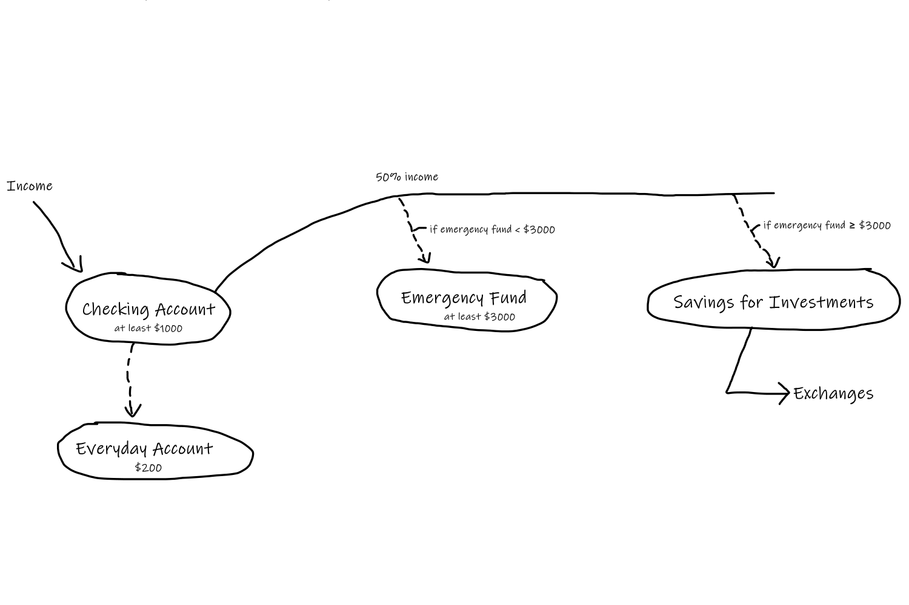

# Personal Finance

I keep a bare minimum of $4,000 AUD across my bank accounts at any time and structure it as follows:

- $1,000 AUD as [cash float](#cash-float) in a checking account
  - With $200 AUD in a separate checking account for everyday spending (eg. dining out, fuel etc.)
- $3,000 AUD in a relatively high-interest savings account for [emergency spending](#emergency-fund) (helps me sleep easier at night)

I try my best to save / invest at least 50% of my income. To make this easier for myself, I have set a recurring automatic transfer to a high-interest savings account which occurs every payday. This automatic transfer allows me to save without worrying about it, freeing up mental energy which I can allocate into making investment decisions. I like to invest in stocks, ETFs, cryptocurrencies and ideas that interest me.

## Cash Float

As mentioned earlier, I keep at least $1,000 as a cash float in my main transactional account. Just like how a small business may keep x amount of money in a cash till, I think it is imperative to have some kind of leeway / buffer that keeps one afloat. Moreover, this main transaction account acts as some sort of central hub that distributes funds to my other accounts. I frequently top-up this account up with every paycheck.

## Emergency Fund

This account is strictly for life-threatening emergencies only. Ideally, an emergency fund should hold at least 3-6 months of expenses. I expect the bare minimum for this fund to increase with age.

## Miscellaneous

### Fitbit

I keep $100 AUD in a separate transaction account that I have set to Fitbit Pay. These funds are to be used under the following circumstances only:

1. If I lose / forget my wallet or phone while out
2. Any non-life threatening 'emergencies' that can be solved for under $100

## Quote Dump

> “Many people take no care of their money till they come nearly to the end of it, and others do just the same with their time.” — Johann Wolfgang von Goethe

## Links

- [Reddit /r/personalfinance: Common Topics](https://www.reddit.com/r/personalfinance/wiki/commontopics)
- Reddit /r/personalfinance: Personal Income Spending Flowchart
  - [Australia](https://i.imgur.com/NmP4zCu.png)
  - [USA](https://i.imgur.com/lSoUQr2.png)
- [Reddit /r/AusFinance: Your links to financial information in Australia](https://www.reddit.com/r/AusFinance/comments/xme1m/your_links_to_financial_information_in_australia/)
